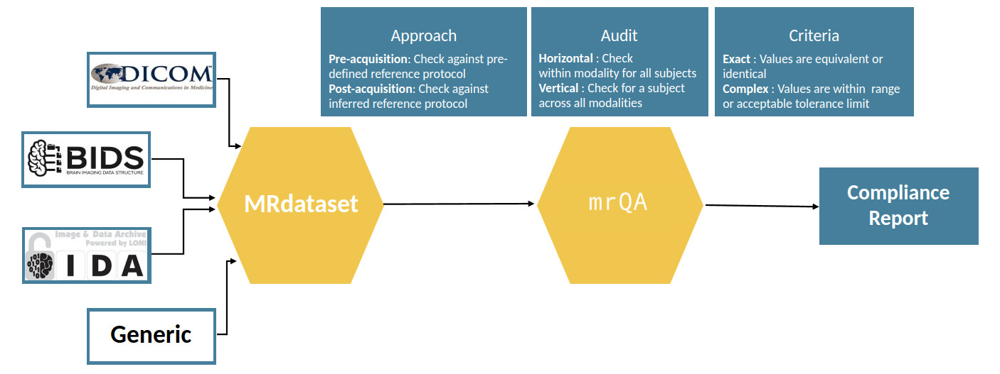

mrQA : automatic protocol compliance checks on MR datasets
=============================================================

.. image:: https://img.shields.io/pypi/v/mrQA.svg
        :target: https://pypi.python.org/pypi/mrQA

.. image:: https://img.shields.io/travis/Open-Minds-Lab/mrQA.svg
        :target: https://travis-ci.com/Open-Minds-Lab/mrQA

.. image:: https://raw.githubusercontent.com/jupyter/design/master/logos/Badges/nbviewer_badge.svg
        :target: https://nbviewer.org/github/Open-Minds-Lab/mrQA/blob/master/examples/usage.ipynb

* Documentation: https://open-minds-lab.github.io/mrQA/

A tool for automatic evaluation of protocol compliance in MRI datasets. The tool analyzes MR acquisition data from DICOM headers and compares it against protocol to determine the level of compliance. It takes as input a dataset in DICOM/BIDS format. The tool outputs a compliance report in HTML format, with a percent compliance score for each protocol. The tool also outputs a JSON file with the compliance scores for each modality. In addition, it highlights any deviations from the protocol. The tool has been specifically created keeping radiologists in mind, but can be used by anyone who wants to evaluate that MR scans are acquired according to the pre-defined protocol and to minimize errors in acquisition process.

Simple schematic of the library:

``mrQA`` uses ``MRDataset`` to efficiently parse various neuroimaging dataset formats, which is available `here <github.com/Open-Minds-Lab/MRdataset>`_.

